# Volume Profile / Market Profile — A Backtesting Study

[](https://www.python.org/)
[](LICENSE)
[](tests/)
[](https://finance.yahoo.com/)
[](output/volume_profile_study.pdf)

A rigorous, honest backtest of the **Volume Profile / Market Profile** method (Steidlmayer / Dalton):
it codes the objective rules — POC reversion, Edge-to-Edge, Value-Area breakout, volume exhaustion
and the 80% Rule — measures **per-trade expectancy after costs** on up to **33 years** of data,
validates everything **out-of-sample** (walk-forward), and then tries hard to **falsify** the result.

The question is not "can I draw nice levels?" but **"is there a real, standalone economic edge once
you account for costs, overfitting and plain long exposure?"** The answer, told without spin, is below.

---

## TL;DR

- 📈 **A real but modest edge exists on the long side of liquid indices.** Out-of-sample, every strategy
  is profitable on QQQ and SPY (QQQ Edge-to-Edge: Profit Factor **2.06**; QQQ Volume exhaustion:
  expectancy **+1.80%/trade**).
- 🔍 **"Volume reading" beats the profile geometry.** Buying *exhaustion / no-supply* (new lows on
  below-average volume) was the most robust tactic OOS on index ETFs (PF **1.5–2.2**). Requiring a
  volume *signal candle* lifts QQQ Edge-to-Edge from PF **1.14 → 1.89**.
- 🇧🇷 **It fails on trending Brazilian single names.** PETR4 and VALE3 produced negative expectancy on
  almost everything — exactly what mean-reversion theory predicts in trend.
- 🧪 **Under falsification it does not survive as a standalone strategy.** Volume permutation, price-only
  ablation, random-entry controls, excess-return and bootstrap tests show the gain is *largely long
  exposure to assets that rose*. **No sleeve** generates alpha over its own exposure, beats the
  risk-free rate at 1% risk, or has a Profit Factor whose 95% CI excludes 1.0. Only **SPY** shows a
  statistically real volume signal — small and fragile in-sample.
- ⌛ **Two famous "legends" do not hold up.** The 80% Rule does not traverse 80% of the time and loses
  after costs; day-types do not predict continuation (if anything, they revert).

> **One-sentence verdict:** Volume Profile is a legitimate *context lens* and the volume filter adds
> real selectivity, but there is no robust, standalone economic edge — it is not a "secret formula".

📄 **Full 19-page technical report:** [`output/volume_profile_study.pdf`](output/volume_profile_study.pdf)

---

## Table of contents

- [Background](#background)
- [Data & methodology](#data--methodology)
- [Results](#results)
  - [1. The out-of-sample scorecard](#1-the-out-of-sample-scorecard)
  - [2. Does it survive walk-forward?](#2-does-it-survive-walk-forward)
  - [3. The diversified portfolio](#3-the-diversified-portfolio)
  - [4. It does not beat buy & hold on return](#4-it-does-not-beat-buy--hold-on-return)
  - [5. The edge is narrow: cost sensitivity](#5-the-edge-is-narrow-cost-sensitivity)
  - [6. Volume reading: the signal candle](#6-volume-reading-the-signal-candle)
  - [7. The legends that fail](#7-the-legends-that-fail)
  - [8. Falsification: is the edge real?](#8-falsification-is-the-edge-real)
- [Conclusions](#conclusions)
- [Reproduce it](#reproduce-it)
- [Project structure](#project-structure)
- [Reference document](#reference-document)
- [Disclaimer](#disclaimer)

---

## Background

A **Volume Profile** is a *volume-by-price* histogram: it shows where, over a chosen window, trading
actually happened. Three levels summarize it — the **POC** (Point of Control, the most-traded price),
and the **Value Area** high/low (**VAH/VAL**, the band holding ~70% of the volume). High-volume nodes
(**HVN**) act like magnets where price "sticks"; low-volume nodes (**LVN**) are gaps it "slips"
through. The method's promise is that these levels frame mean-reversion (fade the edges back to the
POC) and breakouts (acceptance outside the Value Area).

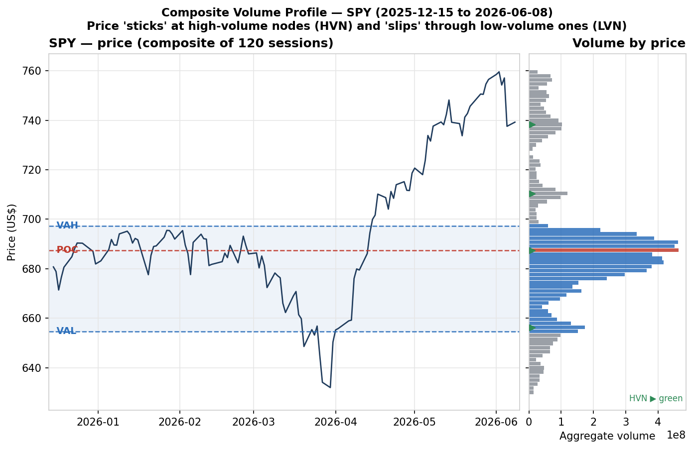

*The composite profile of the last 120 SPY sessions. Price oscillates inside the Value Area and stalls
near high-volume nodes — the geometry the strategy trades around.*

The original method is **intraday** (30-minute blocks, Initial Balance, acceptance in two TPOs). Free
intraday history is short (Yahoo gives ~60 days of 30-minute bars), so a faithful 20-year intraday
backtest is impossible with free data. This study therefore uses a **hybrid scope**: a long **daily**
backtest with a rolling composite profile (where the statistics live), plus the recent intraday sample
used only to sanity-check the 80% Rule.

## Data & methodology

| | |
|---|---|
| **Source** | [Yahoo Finance](https://finance.yahoo.com/) via `yfinance`, downloaded and cached automatically as Parquet |
| **Instruments** | SPY, QQQ (US) · PETR4, VALE3, BOVA11 (Brazil / B3) |
| **History** | Daily OHLCV, per-instrument from inception (SPY 1993, QQQ 1999, PETR4/VALE3 2000, BOVA11 2009) through June 2026 — up to **33 years** |
| **Strategies** | POC reversion (`REV`), Edge-to-Edge (`E2E`), Value-Area breakout (`BRK`), Volume exhaustion / no-supply (`EXH`), and the intraday 80% Rule |
| **King metric** | **Per-trade expectancy after costs**; also Profit Factor, Sharpe, Sortino, max drawdown, payoff, win rate |
| **Costs** | Per-market commission + exchange fee + slippage (US and BR cost models), applied round-trip on every trade |
| **Validation** | **Walk-forward** (8-year train → 3-year test): parameters are optimized only on past data and measured on the unseen future, so reported numbers are genuinely out-of-sample |
| **Falsification** | Volume permutation (500×), price-only ablation, random-entry control (500×), excess return vs exposure & risk-free, and a 10,000-sample bootstrap CI on the Profit Factor |

All figures and tables below come straight from the pipeline (`scripts/run_experiments.py` →
`scripts/build_report.py`); nothing is hand-edited.

## Results

### 1. The out-of-sample scorecard

Every strategy was walk-forward validated on every instrument, long-only, with costs. The pattern is
sharp: the edge concentrates on **liquid US indices** and **disappears (or inverts) on trending
Brazilian single names**.

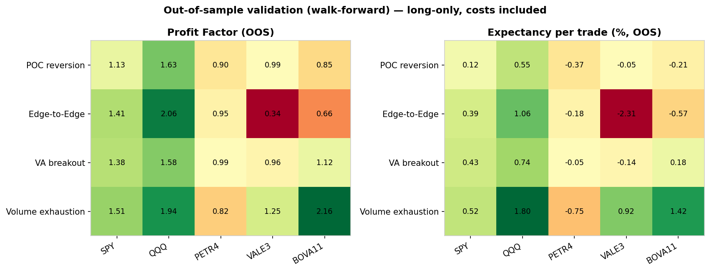

| Strategy | SPY | QQQ | PETR4 | VALE3 | BOVA11 |
|---|---|---|---|---|---|
| POC reversion | 1.13 | 1.63 | 0.90 | 0.99 | 0.85 |
| Edge-to-Edge | 1.41 | **2.06** | 0.95 | 0.34 | 0.66 |
| VA breakout | 1.38 | 1.58 | 0.99 | 0.96 | 1.12 |
| Volume exhaustion | 1.51 | 1.94 | 0.82 | 1.25 | **2.16** |

*Out-of-sample Profit Factor. Green > 1 is profitable. The US column is consistently green; the
PETR4/VALE3 columns are not.*

### 2. Does it survive walk-forward?

The whole point of walk-forward is to catch overfitting: parameters chosen on the training window are
tested on the *next*, unseen window. The flagship sleeves keep a positive expectancy across most
folds rather than collapsing the moment they leave the optimizer's data.

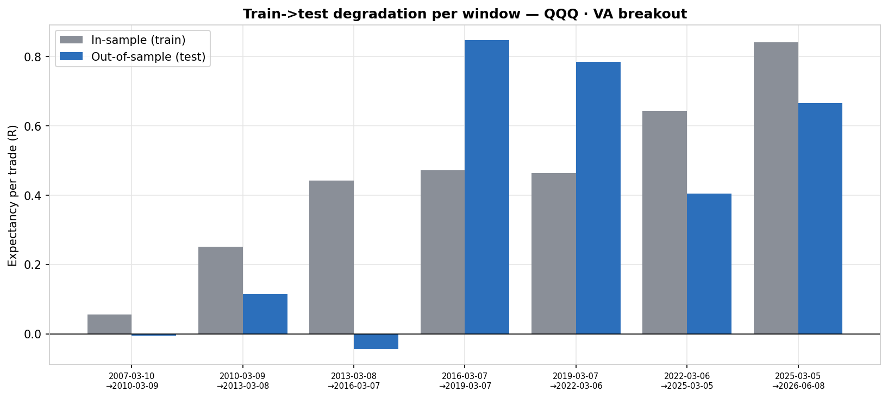

*Per-fold expectancy in R, training (grey) vs out-of-sample (blue). The edge degrades — as it always
does — but does not vanish, which is the bar a tradable signal must clear.*

### 3. The diversified portfolio

Combining only the sleeves that stayed positive out-of-sample (SPY Edge-to-Edge, QQQ VA breakout,
BOVA11 Volume exhaustion) gives a low-exposure stream with a strikingly **shallow drawdown**.

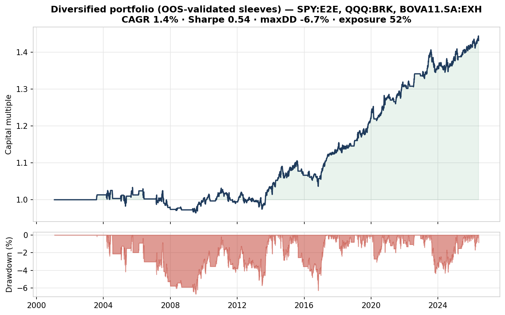

| Portfolio (OOS-validated sleeves) | CAGR | Sharpe | Max drawdown | Exposure |
|---|---|---|---|---|
| 1× | 1.42% | 0.54 | −6.7% | 52% |
| 3× | 4.11% | 0.54 | −19.3% | — |
| 5× | 6.57% | 0.54 | −31.0% | — |

*Because the system is in the market only ~half the time, leverage trades return for drawdown at a
roughly constant Sharpe. There is no free lunch in the risk dial.*

### 4. It does not beat buy & hold on return

Honesty check: a low-exposure, mean-reversion system **will not** out-return simply owning the index
across a 30-year bull market. What it offers is a far smoother ride.

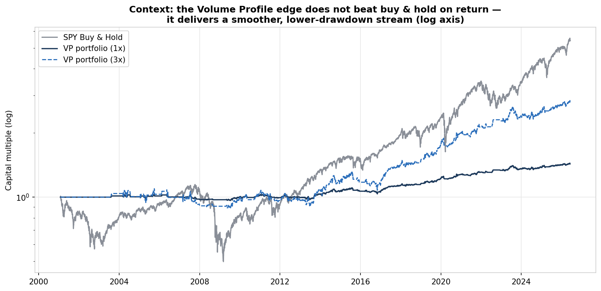

*Buy & hold SPY compounded at **8.8%/yr** but suffered a **−56%** drawdown; the VP portfolio returned
less but drew down a single-digit percentage. Different objective, different product.*

### 5. The edge is narrow: cost sensitivity

The flagship SPY Volume-exhaustion edge is real but **thin** — it survives realistic costs and dies
under high ones.

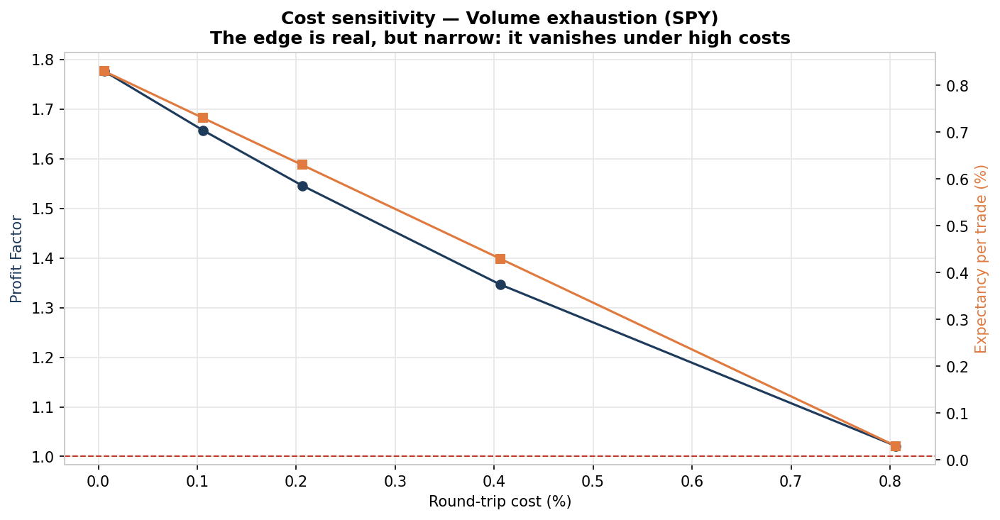

| Round-trip cost | Profit Factor | Expectancy/trade |
|---|---|---|
| 0.01% | 1.78 | +0.83% |
| 0.11% | 1.66 | +0.73% |
| 0.21% | 1.55 | +0.63% |
| 0.41% | 1.35 | +0.43% |
| 0.81% | 1.02 | +0.03% |

*Above ~0.8% round-trip the edge is gone. This is why the method only makes sense on cheap, liquid
instruments.*

### 6. Volume reading: the signal candle

The most interesting positive result: **requiring a volume spike** (a "signal candle") before taking
an Edge-to-Edge entry sharply improves QQQ — until the filter becomes so strict it starves the sample.

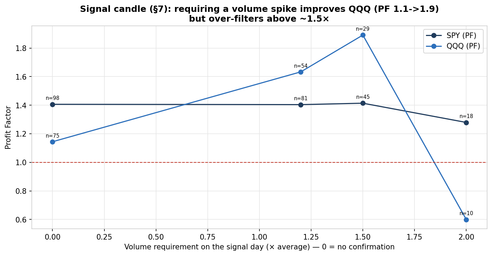

| Volume requirement (× avg) | QQQ trades | QQQ Profit Factor |
|---|---|---|
| 0.0 (no confirmation) | 75 | 1.14 |
| 1.2× | 54 | 1.63 |
| 1.5× | 29 | **1.89** |
| 2.0× | 10 | 0.60 |

*Volume confirmation adds genuine selectivity, but over-filtering (≥ 2×) leaves too few trades to
trust. The signal is in the volume, not the geometry.*

### 7. The legends that fail

Two of the method's most-repeated claims do **not** survive contact with the data.

| Day-types do not predict continuation | The 80% Rule does not traverse 80% |
|---|---|
| 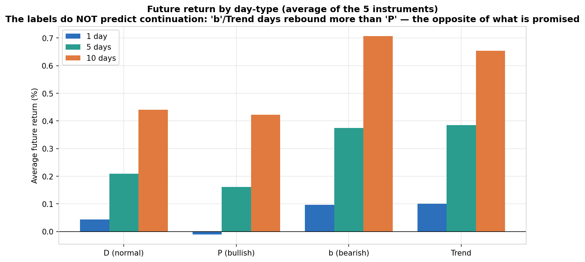 | 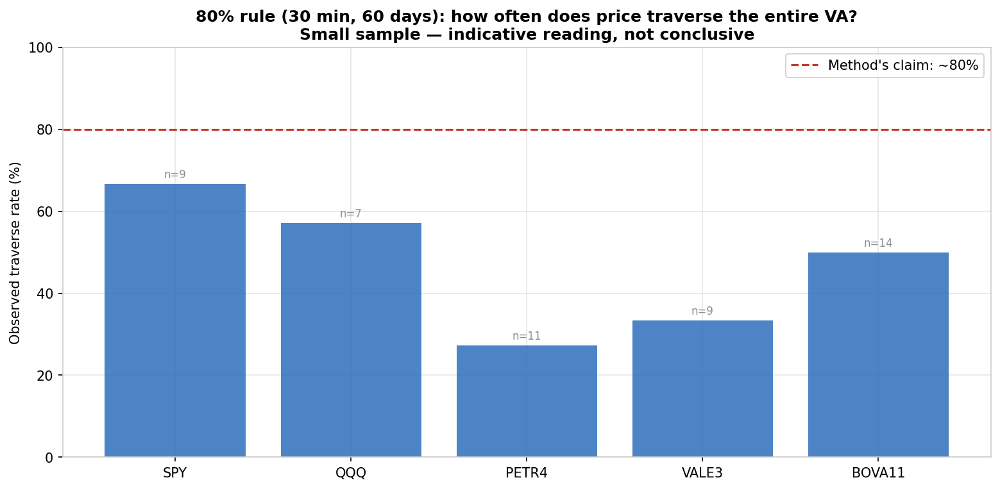 |

*Left: forward returns by day-type — "bearish" days bounce more than "bullish" ones, the opposite of
the promise. Right: in the recent 30-minute sample the Value Area is fully traversed only **27–67%**
of the time, never the advertised 80% (small samples, indicative only).*

### 8. Falsification: is the edge real?

This is the section most backtests skip. With the configuration **frozen** (not re-optimized) and a
fixed seed, every sleeve faced six adversarial tests.

| Volume permutation (Test 1) | Bootstrap CI on Profit Factor (Test 5) |
|---|---|
| 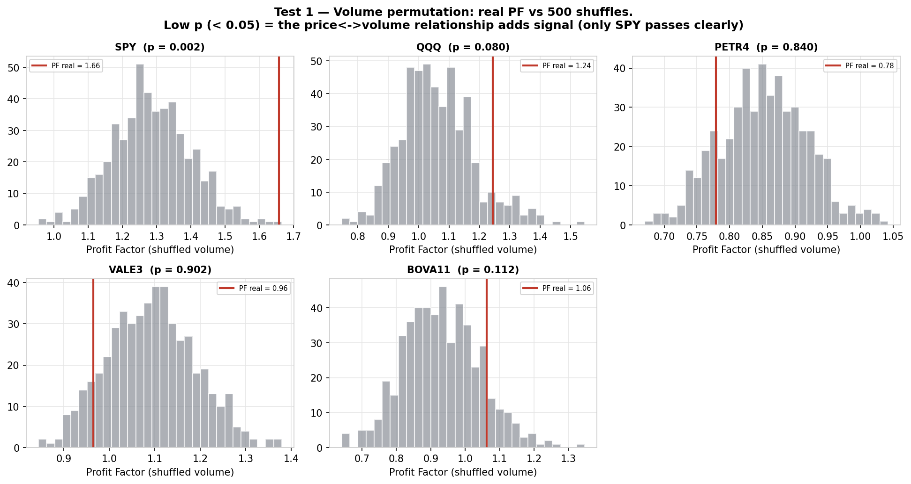 | 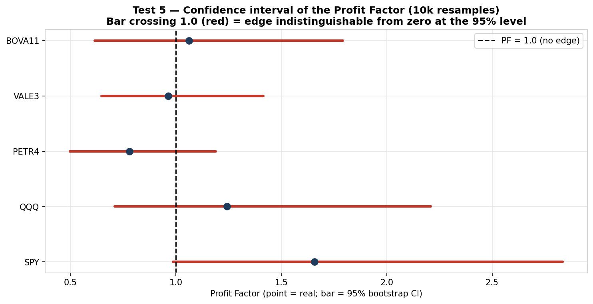 |

The verdict table is humbling and honest:

| Sleeve | Real PF | Shuffle *p* | Beats price-only? | Random-entry *p* | Alpha vs exposure? | Beats risk-free? | 95% CI excludes 1? | **Passes all?** |
|---|---|---|---|---|---|---|---|---|
| **SPY** | 1.66 | **0.002** | ✅ (+0.40) | **0.028** | ❌ | ❌ | ❌ [0.99, 2.83] | **No** |
| QQQ | 1.24 | 0.080 | ✅ (+0.22) | 0.300 | ❌ | ❌ | ❌ [0.71, 2.21] | **No** |
| PETR4 | 0.78 | 0.840 | ❌ | 0.908 | ❌ | ❌ | ❌ [0.50, 1.19] | **No** |
| VALE3 | 0.96 | 0.902 | ❌ | 0.704 | ❌ | ❌ | ❌ [0.65, 1.41] | **No** |
| BOVA11 | 1.06 | 0.112 | ✅ (+0.19) | 0.416 | ❌ | ❌ | ❌ [0.62, 1.79] | **No** |

*Only SPY's volume signal is statistically real (shuffle `p = 0.002`, ablation positive, random-entry
`p = 0.028`) — yet it still fails the economic tests: no alpha over plain exposure, it does not beat
the risk-free rate at 1% risk, and its Profit-Factor confidence interval includes 1.0. The "edge" is,
to a large extent, long exposure to assets that went up.*

## Conclusions

1. **There is a small, real signal in volume on liquid US indices** — strongest in the exhaustion /
   no-supply read and in the volume signal-candle filter — but it is modest and concentrated.
2. **The geometry alone (POC, Value Area, day-types, 80% Rule) is mostly folklore.** The value comes
   from *volume reading* and from using the profile as context, not from the levels as predictions.
3. **As a standalone system it has no robust economic edge.** It does not beat buy & hold on return,
   does not generate alpha over its own exposure, and its Profit Factor is not statistically distinct
   from 1.0 after bootstrapping.
4. **Where it shines is risk:** a diversified, low-exposure portfolio delivered single-digit drawdowns
   versus the index's −56%. That is a risk-management property, not a money-printing one.

The professional takeaway: treat Volume Profile as a *lens*, demand volume confirmation, trade only
cheap and liquid instruments, and keep expectations modest.

## Reproduce it

The first run downloads and caches the data; later runs are offline. Generated figures and the PDF
report are committed, so you can read the study without running anything.

```powershell
# Windows / PowerShell (Python 3.12+)
py -3.12 -m venv .venv
& ".venv\Scripts\Activate.ps1"          # if blocked: Set-ExecutionPolicy -Scope Process -ExecutionPolicy Bypass
pip install -r requirements.txt
pip install -e .

pytest -q                               # 9 tests
python scripts/run_experiments.py       # downloads + caches data, writes output/results.pkl
python scripts/run_falsification.py     # optional: writes output/falsification.pkl
python scripts/build_report.py          # renders output/figures/*.png and the PDF report
```

```bash
# macOS / Linux
python3.12 -m venv .venv
source .venv/bin/activate
pip install -r requirements.txt && pip install -e .
pytest -q
python scripts/run_experiments.py && python scripts/run_falsification.py && python scripts/build_report.py
```

## Project structure

```
src/vptrading/
  data/         download + Parquet cache of OHLCV (yfinance); daily history + recent 30-minute bars
  core/         Volume Profile math (POC, Value Area 70%, HVN/LVN), rolling composite, day-types
  strategies/   POC reversion, Edge-to-Edge, VA breakout, Volume exhaustion, and the 80% Rule
  backtest/     cost models (US/BR), metrics (expectancy, Sharpe, Sortino, drawdown, profit factor),
                and the event-driven simulation engine
  optimization/ grid search + walk-forward (in-sample -> out-of-sample)
  analysis/     claim studies (day-types, volume divergence, absorption) and the falsification suite
  reporting/    figure generation (matplotlib) and the PDF report (reportlab)
scripts/        run_experiments.py · run_falsification.py · build_report.py
tests/          unit tests for the profile math, metrics, and engine
output/figures/ the 19 figures used in the report and this README (committed)
```

## Reference document

[`volume-profile-strategy.md`](volume-profile-strategy.md) — the strategy itself, the math (Value Area
70%, POC, HVN/LVN), the day-types, and a critical evaluation separating what is methodologically sound
from what is trading folklore.

## Disclaimer

This is an educational and research project. **Nothing here is investment advice.** Retail day trading
has a negative base rate (≈97% of participants lose money — Chague & De-Losso, USP/FGV), and leveraged
trading carries the risk of total loss. Past performance does not guarantee future results.

Licensed under the [MIT License](LICENSE).
